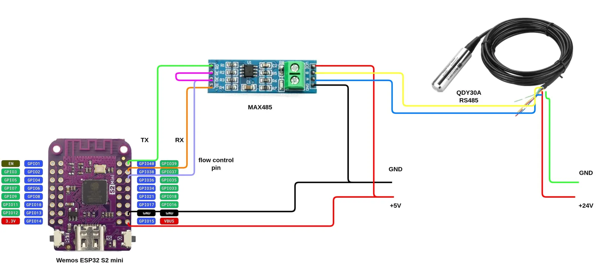

# Levelmeting Waterput V4

## Description

This project is V4 in the levelmeting waterput project. It uses the [QDY30A level sensor with RS485 protocol](https://nl.aliexpress.com/item/1005004940352922.html?srcSns=sns_Copy&spreadType=socialShare&bizType=ProductDetail&social_params=60985872337&aff_fcid=d36cea4a44db45c6bede2523cc9afb1e-1753980282806-07628-_EjQJvbW&tt=MG&aff_fsk=_EjQJvbW&aff_platform=default&sk=_EjQJvbW&aff_trace_key=d36cea4a44db45c6bede2523cc9afb1e-1753980282806-07628-_EjQJvbW&shareId=60985872337&businessType=ProductDetail&platform=AE&terminal_id=5ec7fe4f4f894db8bbb9257240edc8ba&afSmartRedirect=y) because all the previous sensors broke.

This project uses the [ModbusMaster library](https://github.com/4-20ma/ModbusMaster/tree/master) which can be installed from the Library Manager in the Arduino IDE.

## Components

- Sensor is the [QDY30A level sensor with RS485 modbus protocol](https://github.com/4-20ma/ModbusMaster/tree/master).
- [MAX485 module](https://nl.aliexpress.com/item/1005009235324836.html?spm=a2g0o.productlist.main.18.6f7028e663hk5b&algo_pvid=be4b66e5-2800-47ac-b6a6-58f13e3ffc2b&algo_exp_id=be4b66e5-2800-47ac-b6a6-58f13e3ffc2b-17&pdp_ext_f=%7B%22order%22%3A%22-1%22%2C%22eval%22%3A%221%22%7D&pdp_npi=4%40dis%21EUR%2117.32%215.53%21%21%21139.11%2144.42%21%40211b430817539750750754094efdc0%2112000048420270373%21sea%21BE%210%21ABX&curPageLogUid=VVom2pkc4jR8&utparam-url=scene%3Asearch%7Cquery_from%3A) so that the Arduino/ESP32 can communicate with the modbus protocol by using the RX and TX pins.
- AZDelivery ESP32 Dev Kit C V4 for wireless data transmission which I had lying around.
- [220-240V to 24V power adapter](https://www.amazon.com.be/-/en/Universal-Adapter-220-240V-Inverter-Converter/dp/B0DRP7CS6Y/ref=sr_1_6?crid=1ACSXPUVS5M3O&dib=eyJ2IjoiMSJ9.FTbxj5E1wm82PugM4UbSTGT1U-mJWSjutiHkte5HbkOeKfQrB-BOpuIBgImuRtzR-Oxsbv6aAav57drT663OdneUMQ0v3lXwz_fyhLJ6fqaBDiDpmi3t64ZKGnJhwVYG2fniTcgwXYQBbRFDHbBWO10F0hNb3RetDSqDfkFQakxUy2J-pAYLw4MWh0_5NM9YgepXiq3lA2xNkwteyM8PkXWb3mjuG0ey11ltC3uAtEaBidy8vM2pcyvCirzr-JK_tczkhxNdXqsYSO3U6uUHg2HoZKGJPsb2ADYXPQJMeao.7CeGK0aJhAgOUL4NGwdO5NkmGQ1lxo9eezmmLnGFa6c&dib_tag=se&keywords=240v%2BAC%2Bto%2B24v%2Bdc%2Badapter&qid=1756312614&sprefix=240v%2Bac%2Bto%2B24v%2Bdc%2Badapter%2Caps%2C95&sr=8-6&th=1) as the sensor works on 24V.
- [24V to 5V step-down converter](https://www.amazon.com.be/-/en/Heemol-Converter-Module-DC-DC-Power/dp/B0BCV6GRH5/ref=sr_1_3?crid=1N3TF49LMAD7M&dib=eyJ2IjoiMSJ9.q-0kuL72pe2IKbCABHzv8yXOsoQ4-v-Wq0jyu740BLkh13zqbLLy1FTG98uMWzEd8oz7OTgdK4OSP_4BK1gTu9wjp9CoapG2o3FZpXtIWlHqLC9P6f17gwq7Obhck1AqX469Dt1Ga9VJU1P0AJyKzVB0Ln-N5Ue2JrF5tVuZJ5tERdzsEsNTRxSBOX8tx5-2qo5J622tHXK5aL6bRXPW_Zn6CSXFCy_SFn3BGmzdMCV8JSYf2uHlnAjMfwTZvKOJRcqpMr4RmKVLJPQKJ-YGLqcOWeauEC0VQ_aWCukiv7Q.-T0r3asJ5W8xXmG-Gu4cFkVHnN3vhC2m68qT4c__YZo&dib_tag=se&keywords=dc+dc+24+to+5v+converter&qid=1756310998&sprefix=dc+dc+24+to+5v+converter%2Caps%2C92&sr=8-3) to power the ESP32. The MAX485 module is powered by the 5V pin of the ESP32.

## Diagram

Thanks lejmr for this diagram. I used it to test my sensor. It is wrong for the TX and RX pins, they should be swapped. (See below for more.) The rest is the same as in this diagram.


My adaptation:
I used pin 2 on the ESP32 to connect the DE and RE pins from the MAX485 module.

See the final KiCad diagram under the `waterputv4Schematics` folder. Here is a screenshot in case you don't have KiCad.


## Testing the sensor

This took a lot of trial and error but I got it working in the end. Some important remarks:

1. R0 from the MAX485 module should be connected to RX on the ESP32 and DI to TX. This is wrong in the original diagram I used.
2. The provided screw terminals on the MAX485 module are useful to connect the sensor to.
3. You cannot use the Serial port for debugging as you need the TX and RX pins to communicate with the sensor. I used the Bluetooth Serial library instead. You need to download the Bluetooth Serial app on your phone to connect to the wireless Serial.
4. When uploading the code, disconnect TX, RX, 5V and GND from the MAX485 and ESP32.
5. The test code is in the folder `testcode`.

## Final integration

- I have been using ThingSpeak for all the previous versions and it works quite well to store the data.
- The Bluetooth Serial library took too much space, so I have switched to the TelnetStream library. You need to install PuTTY and enter the IP adress which can be obtained from the Serial monitor. After this, it connects to the modbus sensor and from that moment on, all logging will happen with the telnet stream on PuTTY.
- You need to add a `credentials.h` file in the same folder as the final code. You need to fill this template with your own credentials.

```c++
#define mySSID "xxxxx"
#define myPASSWORD "xxxxx"
#define myChannelNumber 111111
#define myWriteAPIKey "xxxxxx"
```

## Resources

- [Datasheets that came in the box](https://h5.hlcode.com.cn/?id=NK1LFtJ&f=wx)
- [Thanks a lot to lejmr for this project!](https://github.com/lejmr/dyi-ha-water-management)
- [This tutorial has helped me a lot](https://how2electronics.com/how-to-use-modbus-rtu-with-esp32-to-read-sensor-data/)
